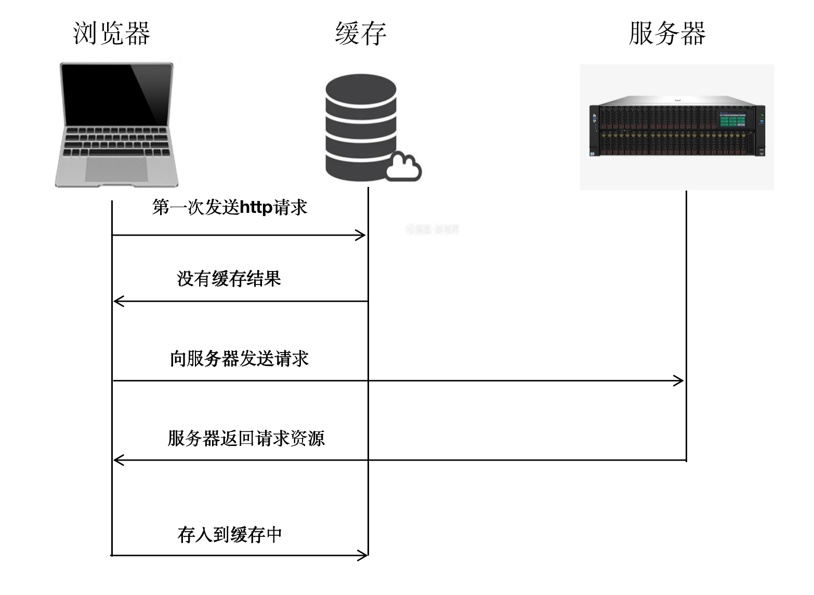

# 浏览器缓存

## 什么是浏览器缓存

在正式开始讲解浏览器缓存之前，我们先来回顾一下整个web应用的流程。

上图展示了一个web应用最简单的结构，客户端向服务端发送HTTP请求，服务器端从数据库中获取数据，然后计算处理，之后向客户端返回HTTP响应。

那么上边的整个流程中，那些地方耗费时间呢？总结起来有两个方面

- 发送请求的时候
- 涉及到大量计算的时候

一般来讲，上边的两个阶段比较耗费时间

首先是发送请求的时候。这里所说的请求，不仅仅是http请求，也包括服务器向数据库发起查询数据的请求。

其次是大量计算的时候，一般涉及到大量计算，主要是服务器端和数据库端，服务器端要进行计算这个很好理解，数据库要根据服务器发过来的查询命令查询到对应的数据，这也是比较耗时的一项工作。

因此，单论缓存的话，我们其实在很多地方都可以做缓存，例如：

- 数据库缓存
- CDN缓存
- 代理服务器缓存
- 浏览器缓存
- 应用层缓存

针对各个地方作出适当的缓存，都能够很大程度上优化整个web应用的性能，但是要逐一讨论的话，是一个很大的工程量，所以本文我们主要来看一下浏览器缓存，这是和我们前端开发息息相关的。

整个浏览器的缓存过程如下：

从上图我们可以看出，整个浏览器端的缓存其实没有想象的那么复杂，其最基本的原理就是：

- 浏览器每次发送请求，都会先在浏览器缓存中，查找该请求的结果以及缓存标识
- 浏览器每次拿到返回结果都会将该结果和缓存标识存入浏览器缓存中

以上俩点就是浏览器缓存机制的关键，它确保了每个请求的缓存存入与读取，只要我们再理解浏览器缓存的使用规则，那么所有的问题就迎刃而解了。

接下来，我们从两个维度去介绍浏览器缓存

- 缓存的储存位置
- 缓存的类型

## 按照缓存位置分类

### Service Worker  

 Service Worker  是运行在浏览器背后的独立线程，一般可以用来实现缓存功能。

使用  Service Worker  的话，传输协议必须是 https ，因为  Service Worker 中涉及到请求拦截，所以必须用 https 协议来确保安全。

 Service Worker 的缓存与浏览器的其他内建的缓存机制不同，它可以让我们自由控制缓存那些文件，如何匹配缓存，如何读取缓存，并且缓存是持续性的。

  Service Worker 实现缓存功能一般分为三个步骤，首先需要注册  Service Worker ，然后监听 install 事件以后就可以缓存需要的文件，那么在下次用户访问的时候就可以通过拦截请求的方式查询时候存在缓存，存在缓存的话就可以直接读取缓存文件，否则就去请求数据。

  当  Service Worker  没有命中缓存的时候，我们需要去调用 fetch 函数获取数据，也就是说，如果我们没有在 Service Worker 命中缓存的话，会根据缓存查找优先级去查找数据。

但是不管我们是从 memory cache 还是从网络请求中获取的数据，浏览器都会显示我们是从 Service Worker 中获取的内容。

### Memory Cache

Memory Cache 也就是内存中的缓存，主要包含的是当前页面中已经抓取到的资源，例如页面上已经下载的样式，脚本和图片等。

读取内存中的数据肯定比磁盘快，内存缓存虽然读取高效，可是缓存持续性很短，会随着进程的释放而释放。一旦我们关闭tab页面，内存中的缓存也就释放了。

那么既然内存缓存这么高效，我们是不是能让数据都存放到内存中呢？

这是不可能的，计算机中的内存一定比硬盘容量小的多，操作系统需要精打细算内存的使用，所以能让我们使用的内存实际上是不多的。

当我们访问页面以后，再次刷新页面，可以发现很多数据都来自于内存缓存。

Memory Cache 机制保证了一个页面中如果有两个相同的请求。例如两个src相同的img，href相同的link，实际都只会请求一次。

### Disk Cache

Disk Cache 也就是存储在硬盘上的缓存，读取速度慢点，但是什么都储存到磁盘中，比之 momery cacahe 胜在容量和存储时效性上。

在所有的浏览器中，Disk Cache 覆盖的面基本上是最大的。它会根据HTTP Header 中的字段判断哪些资源需要缓存，哪些资源可以不请求直接使用，哪些资源已经过期需要重新请求。

并且即使在跨站点访问的情况下，相同地址的资源一旦被硬盘缓存下来，就不会再次去请求资源。绝大部分的缓存都来自于 Disk Cache。

凡事持久性存储都会面临容量增长的问题，Disk Cache也不例外。

在浏览器自动清理的时候，会有特殊的算法把最老的或者最可能过时的资源删除，因此是一个一个删除的。不过，每个浏览器识别最老的或者最可能过时的资源算法不尽相同，这也可以看作各个浏览器差异性的体现。

### Push Cache

Push Cache 直译 推动缓存，属于http/2中新增的内容

当以上三种缓存都没有命中时，它才会被使用，它会在会话（Session）中存在，一旦会话结束就释放，并且缓存时间也很短，在chrome浏览器中只有五分钟左右，同时，他也严格执行http/2头中的缓存指令。

但是，目前还不太普及。

结论点：

- 所有的资源都能被推送，并且能够被缓存，但是 Edge和chrome支持相对较差
- 可以推送 no-cache和 no-store的资源
- 一旦连接关闭，Push Cache就会被释放
- 多个页面可以使用同一个http/2的连接，也就可以使用同一个Push Cache，这主要还是依赖浏览器的实现而定，出于对性能的考虑，有的浏览器会对相同域名但不同tab标签使用同一个http连接
- Push Cache中的缓存只能被使用一次
- 浏览器可以拒绝接受已经存在的资源推送
- 你可以给其他域名推送资源

如果一个请求在上边的几个位置都没有找到缓存，那么浏览器会正式发送网络请求去获取内容，之后为了提升请求的缓存命中率，自然要把这些资源加入到缓存中，具体来说：

- 根据 Service Worker  的handler决定是否存入 Cache Storage（额外的缓存位置）。Service Worker  是由开发者编写的额外的脚本，且缓存位置独立，出现较晚，使用不太广泛。
- Memory Cache 保存一份资源的引用，以备下次使用。Memory Cache是浏览器为了加快读取缓存速度而进行的自身优化行为，不受开发者控制，也不受http协议头的约束，算是一个黑盒。
- 根据http请求头的相关字段（Cache-Control，Pragma）等，决定是否加入 Disk Cache，平时使用最多的。

## 按照缓存类型分类

根据缓存类型来进行分类，可以分为**强制缓存**和**协商缓存**，需要注意的是，无论是强制缓存还是协商缓存，都是属于 Disk Cache 或者叫做 http cache 里面的一种。

### 强制缓存

强制缓存的含义是，当客户端请求后，会先访问缓存数据库查看缓存是否存在，如果存在则直接返回，不存在则请求真的服务器，响应后再写入缓存数据库。

强制缓存直接减少请求数，是提升最大的缓存策略，如果考虑使用缓存来优化网页性能的话，强制缓存应该首先被考虑。

可以造成强制缓存的字段是Cache-Control和Expires

#### Expires

这是Http1.0的字段，表示缓存到期时间，是一个绝对的时间，如
> Expires: Thu， 10  Nov  2017  08:45:11  GMT

在响应消息头中，设置这个字段后，就可以告诉浏览器，在未过期之前不需要再次请求。

但是这个字段设置有两个缺点

- 由于是绝对时间，用户可能会将客户端本地的时间进行修改，而导致浏览器判断缓存失效，重新请求该资源。此外，即便不考虑自行修改的因素，时差或者误差等因素也可能造成客户端和服务端的时间不一致，致使缓存失效。
- 写法太复杂了，表示的时间字符串多个空格，少个字母，都会导致变为非法属性从而设置失效。

#### Cache-control

已知 Expires的缺点后，在http1.1中，增加了一个字段  Cache-control ，该字段表示资源的最大有效时间，在该时间内，客户端不需要向服务器发送请求。

这两者的区别就是前者是绝对时间，而后者是相对时间。如下：
> Cache-control : max-age=2592000 

下边列举一些Cache-control常用的值：完整可以参考MDN

- max-age：最大有效时间
- must-revalidate：如果超过了max-age的时间，浏览器必须向服务器发送请求，验证资源是否还有效
- no-cache：字面意思不要缓存，实际上还是要求服务端返回内容，是否使用这个内容由后边的协商缓存决定
- no-store：真正意义上的不要缓存，所有内容都不缓存，包括强制缓存和协商缓存。
- public：所有内容都可以被缓存（包括客户端和代理服务器，如CDN）
- private: 所有内容只有客户端才可以缓存，代理服务器不可以缓存，默认值。

这些值可以混合使用，例如 Cache-control ：public，max-age=2948000。在混合使用时，优先级如下：

> max-age=0和no-cache等价吗？
> 从规范的字面意思来说，max-age到期应该重新验证，而no-cache是必须重新验证，但实际情况以浏览器实现为准，大部分情况下他们两个的行为是一致的。（如果max-age=0，must-revalidate和no-cache等价）

在http/1.1之前，如果想使用no-cache，通常是使用Pragma字段，如 Pragma：no-cache，这也是Pragma唯一的取值。

但是这个字段只是浏览器约定俗成的实现，并没有确切规范，因此缺乏可靠性，它应该只作为一个兼容性字段出现，在当前网络环境下其实用处已经很小。

总结一下，自从http/1.1开始，Expires逐渐被Cache-control取代。

Cache-control是一个相对时间，即使客户端事件发生变化，相对时间也不会随之改变，这样可以保证服务器和客户端的时间一致性。而且Cache-control可配置性非常强大，Cache-control优先级高于Expires。

为了兼容http/1.0和http/1.1，实际项目中两个字段我们都会设置。

### 协商缓存

当强制缓存失效时（超过规定时间），就需要使用协商缓存，由服务器决定缓存是否失效。

流程上说，浏览器先请求缓存数据库，返回一个缓存标识，之后浏览器拿这个缓存标识和服务器通讯，如果缓存未失效，则返回http状态码304，表示继续使用，于是客户端继续使用缓存。

如果失效，则返回新的数据和缓存规则，浏览器响应数据后，再把规则写入到缓存数据库。

协商缓存在请求数上和没有缓存是一致的，但是如果304的话，返回的仅仅是一个状态码而已，并没有实际的文件内容，因此，在响应体体积上的节省是它优化点。

它的优化点主要体现在**响应**上面通过减少响应体体积，来缩短网络传输时间。所以和强制缓存相比提升幅度较小，但总比没有缓存好。

协商缓存是可以和强制缓存一起实现的，作为在强制缓存失效后的一种后备方案，实际项目中他们也经常一起出现。

协商缓存有两组字段（不是两个）

- Last-Modified和 if-Modified-since
- ETag和if-None-Match

#### Last-Modified和 if-Modified-since

1. 服务器通过Last-Modified字段告知客户端，资源最后一次被修改的时间，例如
> Last-Modified: Thu，10  Nov  2017  08:45:11  GMT
2. 浏览器将这个值和内容一起记录到缓存数据库中
3. 下一下请求相同资源时，浏览器从自己的缓存中找出不确定是否过期的缓存。因此在请求头中将上次Last-Modified的值写入到请求头的if-Modified-since字段
4. 服务器会将if-Modified-since的值与Last-Modified字段进行对比，如果相等，则表示未修改，响应304，反之，表示修改了，响应200，并返回数据。

但是，它还是有一定的缺陷的：

- 如果资源更新的速度是秒以下为单位，那么该缓存是不能被使用的，因为它的时间单位最低是秒
- 如果文件是通过服务器动态生成的，那么该方法的更新时间永远是生成的时间，尽管文件可能没有变化，所以起不到缓存的作用。

因此在http/1.1出现了ETag和if-None-Match

#### ETag和if-None-Match

为了解决上述问题出现了一组新的字段ETag和if-None-Match。

ETag存储的是文件的特殊标识（一般是一个hash值），服务器存储文件的ETag字段。

之后的流程和 Last-Modified一致，只是 Last-Modified字段和它所表示的更新时间变成了ETag字段和它所表示的文件hash，把if-Modified-since变成了if-None-Match

浏览器在下一次加载资源的时候向服务器发送请求的时候，会将上一次返回的ETag值放到请求头里的if-None-Match里，服务器只需要比较客户端传的if-None-Match跟自己服务器上该资源的ETag字段是否一致，就能很好的判断资源是否被修改过了。

如果不匹配，那么直接以常规的GET 200 ，将新的资源发给客户端（当然也包含新的ETag）；如果ETag字段是一致的，则直接返回304告诉客户端直接使用本地缓存即可。

两者之间的简单对比：

- 首先在精确度上，ETag优于 Last-Modified
   Last-Modified的时间以秒为单位，如果单个文件在1秒内发生变化，那么 Last-Modified其实并没有体现出来修改，但是ETag是一个hash值，每次都会改变确保精度。
- 性能上，ETag要低于Last-Modified，毕竟Last-Modified只需要记录时间，而ETag需要向服务器通过算法来计算hash值
- 在优先级上，服务器先考虑ETag，也就是说ETag高于Last-Modified

## 缓存读取规则

当浏览器要请求资源时：
1. 从Service Worker  中获取内容（如果设置了Service Worker  ）
2. 查看Memory Cache是可用的，会被优先使用（如果匹配的话），其次才是
3. 查看Disk Cache
   - 如果有强制缓存并且未失效，使用强制缓存，不请求服务器，此时的状态码全部是200
   - 如果有强制缓存已失效，使用协商缓存，比较后确定是304还是200
4. 发送网络请求，等待网络响应
5. 把响应内容存入Disk Cache（如果http响应头有相关的配置）
6. 把响应内容存入Memory Cache（无视http头信息的配置）
7. 把响应内容存入Service Worker 的Cache Storage（如果设置了Service Worker ）

## 浏览器行为

在了解整个缓存策略或者说缓存读取流程后，我们还需要了解一个东西，那就是用户对浏览器的不同操作，会触发不同的缓存读取策略

对应主要有三种不同的浏览器行为

- 打开网页，地址栏输入地址：查找Disk Cache是否有匹配，如果有使用，没有发送网络请求。
- 普通刷新（F5）,因为tab并没有关闭，因此Memory Cache是可用的，会被优先使用（如果匹配的话），其次才是Disk Cache
- 强制刷新（crtrl+f5），浏览器不使用缓存，因此发送的请求头部均带有Cache-control：no-cache（为了兼容，还带了Pragma：no-cache），服务器直接返回200和最新内容

## 缓存的最佳实践

### 频繁变动的资源

> Cache-control：no-cache

对于频繁变动的资源，首先需要使用Cache-control：no-cache使浏览器每次都发送请求，然后配合ETag或者 Last-Modified来验证资源是否有效

这样的做法虽然不能节省请求数量，但能显著减少响应数据大小

### 不变的资源

>  Cache-control：max-age=31536000（一年）

通常在处理这类资源时，给他们 Cache-control配置一个很大的max-age，这样浏览器之后请求相同的url会命中缓存。

为了解决更新的问题，需要在文件名中添加hash，版本号等动态字符，之后动态更新字符，从而达到更改引用的目的，让之前的强制缓存失效（其实并未失效），只是不再使用了而已。

在线提供的类库（jquery-3.3.1.min.js loadsh.min.js）均采用这个模式。