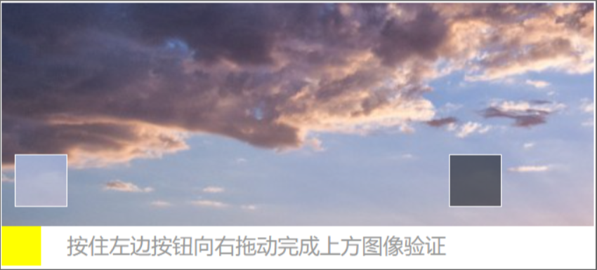
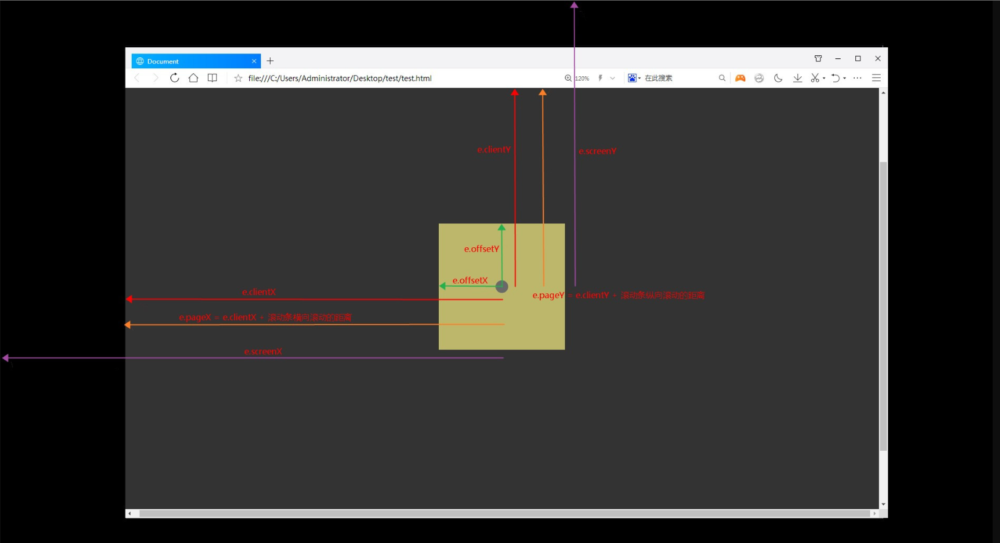
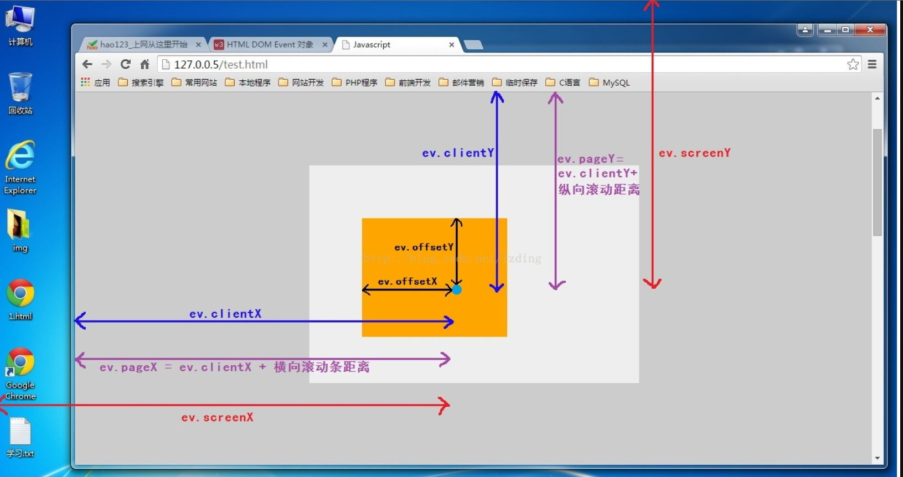

#### 拼图校验

##### 需求背景

拼图校验可以用于，用户登录/注册时，当用户输入账号和密码后，进行拼图校验，样板如图所示：

##### 实现过程拆解

###### 如何做背景图?

两个方案：

1. 利用随机图片地址：https://picsum.photos/300/200，用canvas画一张背景图

```vue

<template>
  <div class="puzzle-verify">
    <!-- 拼图区域 -->
    <div class="puzzle-wrapper">
      <canvas ref="canvas" :width="width" :height="height"></canvas>
    </div>
  </div>
</template>

<script>
  props: {
    // 拼图背景图片
    imgUrl:{
        type:String,
        default:'https://picsum.photos/300/200'
    }
    width: {
      // 画布宽度
      type: Number,
      default: 300,
    },
    height: {
      // 画布高度
      type: Number,
      default: 200,
    },
  },

// 初始化拼图
async initPuzzle() {
      const canvas = this.$refs.canvas;
      const ctx = canvas.getContext("2d");

      // 加载图片
      const img = await this.loadImage(this.imgUrl);

      // 绘制完整图片
      ctx.drawImage(img, 0, 0, this.width, this.height);
    
    },

     // 加载图片
    loadImage(url) {
      return new Promise((resolve, reject) => {
        const img = new Image();
        img.crossOrigin = "Anonymous";
        img.onload = () => resolve(img);
        img.onerror = reject;
        img.src = url;
      });
    },
</script>

```

2. 调后端接口，让后端随机生成图片，前端拿后端数据。

```js

data(){
    return {
        puzzleImage:'',//背景图
    }
}
getImage().then((res)=>{
    this.puzzleImage=res.data.puzzleImage//假设图片是这样取得
})

```

###### 如何实现滑块？

两个方案：

1. 像拿背景图一样，调接口拿滑块

```js

data(){
    return {
        slideImage:'',//滑块图
    }
}
getImage().then((res)=>{
    this.slideImage=res.data.slideImage//假设图片是这样取得
})

```


2. 用canvas的方法，将背景图随机挖一个空，作为滑块

```vue
<template>
  <div class="puzzle-verify">
    <!-- 拼图区域 -->
    <div class="puzzle-wrapper">
        <!-- 背景图 -->
      <canvas ref="canvas" :width="width" :height="height"></canvas>
      <!-- 滑块区域 -->
       <div
        class="puzzle-piece"
        :style="pieceStyle"
        @touchstart="startDrag"
      ></div>
    </div>
  </div>
</template>

<script>
  props: {
    // 拼图背景图片
    imgUrl:{
        type:String,
        default:'https://picsum.photos/300/200'
    }
    width: {
      // 画布宽度
      type: Number,
      default: 300,
    },
    height: {
      // 画布高度
      type: Number,
      default: 200,
    },
  },
  computed: {
    pieceStyle() {
      return {
        // 这句保证了拼图块的位置与挖空的地方对应
        top: this.targetY - 25 + "px",
        left: this.pieceX + "px",
        backgroundImage: `url(${this.tapUrl})`,
      };
    },
  },
data(){
    return{
          targetX: 0, // 目标位置X坐标
      targetY: 0, // 目标位置Y坐标
      pieceX: 0, // 拼图块当前X坐标
      tapUrl: "",
    }
}
// 初始化拼图
async initPuzzle() {

      // 随机生成目标位置
      // this.targetX 和 this.targetY 的值分别在 [25, this.width - 25] 和 [25, this.height - 25] 范围内随机生成。这可以确保目标位置不会太靠近边界，留出一定的边距。
      this.targetX = Math.random() * (this.width - 50) + 25;
      this.targetY = Math.random() * (this.height - 50) + 25;
      // 获取挖空区域的图片数据
      // 先获取再挖空，顺序反了，获取的滑块啥也没有。
      const imageData = ctx.getImageData(
        this.targetX-25,
        this.targetY-25,
        50,
        50
      );
      // 挖空目标区域
      ctx.clearRect(this.targetX - 25, this.targetY - 25, 50, 50);

      // 创建一个新的 canvas 用于存放挖空区域的图片
      const pieceCanvas = document.createElement("canvas");
      pieceCanvas.width = 50;
      pieceCanvas.height = 50;
      const pieceCtx = pieceCanvas.getContext("2d");
      pieceCtx.putImageData(imageData, 0, 0);

      // 将挖空区域的图片转换为 data URL
      const pieceImageUrl = pieceCanvas.toDataURL();
      this.tapUrl = pieceImageUrl;
    
    },

</script>
```


###### 如何实现滑动？

1. 监听mousemove或者touchmove事件，当发生移动时，让当前clientX减去起始点的clientX，是滑块移动的距离。

```js
// 开始拖动时
startDrag(e){
      this.startX = e.touches[0].clientX||e.clientX;
      
      document.addEventListener("touchmove", this.dragging);
      // ....
}
// 拖动中
dragging(e){
  const eventX = e.touches[0].clientX||e.clientX;
      this.pieceX = eventX - this.startX;
}


```

2. 将移动的距离赋值给marginLeft

 赋值有两种方式：

- 通过计算属性，动态更新marginLeft


```js

 <template>
<div
        class="puzzle-piece"
        :style="pieceStyle"
        @touchstart="startDrag"
      ></div>
  </template>

export default{
  computed: {
    // 动态样式，实时更新
    pieceStyle() {
      return {
        // 这句保证了拼图块的位置与挖空的地方对应
        top: this.targetY - 25 + "px",
        left: this.pieceX + "px",
        backgroundImage: `url(${this.tapUrl})`,
      };
    },
  },
}

```

- 在滑动过程中，获取元素设置marginLeft

```js
 <template>
<div
    ref='slide_block'
        class="puzzle-piece"
        :style="pieceStyle"
        @touchstart="startDrag"
      ></div>
  </template>

// 拖动中
dragging(e){
  const eventX = e.touches[0].clientX||e.clientX;

      this.pieceX = eventX - this.startX;

      // 改变滑块位置
      this.$refs.slide_block.style.marginLeft = this.pieceX + 'px'
}

```

###### 代码详情

>用canvas有前端独立完成，但是这种方式不安全，以下：

```vue

<template>
  <div class="puzzle-verify">
    <!-- 拼图区域 -->
    <div class="puzzle-wrapper">
      <canvas ref="canvas" :width="width" :height="height"></canvas>
      <!-- 滑块区域 -->
      <div
        class="puzzle-piece"
        :style="pieceStyle"
        @touchstart="startDrag"
      ></div>
    </div>

    <!-- 操作区域 -->
    <div class="puzzle-controls">
      <button @click="$emit('close')">取消</button>
      <span class="tips">{{ tips }}</span>
    </div>
  </div>
</template>
  
  <script>
export default {
    // 有些数据可以动态有父组件传入
  props: {
  // 拼图背景图片
    imgUrl:{
        type:String,
        // 这是随机生成图片的地址
        default:'https://picsum.photos/300/200'
    }
    width: {
      // 画布宽度
      type: Number,
      default: 300,
    },
    height: {
      // 画布高度
      type: Number,
      default: 200,
    },
  },
  data() {
    return {
      targetX: 0, // 目标位置X坐标
      targetY: 0, // 目标位置Y坐标
      pieceX: 0, // 拼图块当前X坐标
      startX: 0, // 拖拽起始X坐标
      isDragging: false, // 是否正在拖拽
      tips: "请拖动拼图到正确位置",
      tapUrl: "",//滑块
    };
  },
  computed: {
    // 用计算属性，可以动态滑块的位置
    pieceStyle() {
      return {
        // 这句保证了拼图块的位置与挖空的地方对应
        top: this.targetY - 25 + "px",
        left: this.pieceX + "px",
        //滑块地址
        backgroundImage: `url(${this.tapUrl})`,
      };
    },
  },
  mounted() {
    this.initPuzzle();
  },
  methods: {
    // 初始化拼图
    async initPuzzle() {
      const canvas = this.$refs.canvas;
      // const canvasGap=this.$refs.canvasGap;
      const ctx = canvas.getContext("2d");

      // 加载图片
      const img = await this.loadImage(this.imgUrl);

      // 绘制完整图片
      ctx.drawImage(img, 0, 0, this.width, this.height);

      // 随机生成目标位置
      // this.targetX 和 this.targetY 的值分别在 [25, this.width - 25] 和 [25, this.height - 25] 范围内随机生成。这可以确保目标位置不会太靠近边界，留出一定的边距。
      this.targetX = Math.random() * (this.width - 50) + 25;
      this.targetY = Math.random() * (this.height - 50) + 25;
      // 获取挖空区域的图片数据，作为滑块
    //   先获取再挖空，不然获取的滑块就是个马赛克
      const imageData = ctx.getImageData(
        this.targetX-25,
        this.targetY-25,
        50,
        50
      );
      // 挖空目标区域
      ctx.clearRect(this.targetX - 25, this.targetY - 25, 50, 50);

      // 创建一个新的 canvas 用于存放挖空区域的图片
      const pieceCanvas = document.createElement("canvas");
    //   新canvas的宽高就是滑块宽高，均为50
      pieceCanvas.width = 50;
      pieceCanvas.height = 50;
      const pieceCtx = pieceCanvas.getContext("2d");
      pieceCtx.putImageData(imageData, 0, 0);

      // 将挖空区域的图片转换为 data URL
      const pieceImageUrl = pieceCanvas.toDataURL();
       //可以将 pieceImageUrl 用于拼图块的背景图片
      // 滑块地址，base64编码
      this.tapUrl = pieceImageUrl;
     
    },

    // 加载图片，生成一个img标签
    loadImage(url) {
      return new Promise((resolve, reject) => {
        const img = new Image();
        img.crossOrigin = "Anonymous";
        img.onload = () => resolve(img);
        img.onerror = reject;
        img.src = url;
      });
    },

    // 开始拖拽
    startDrag(e) {
      this.isDragging = true;
      // 获取滑块初始值
      // 或之前是pc段，或者后是移动端
      this.startX =  e.clientX||e.touches[0].clientX;
      // 根据需求，选择移动端还是pc端

      //监听手机端的触摸事件
      document.addEventListener("touchmove", this.dragging);
      document.addEventListener("touchend", this.stopDrag);
      //监听pc端鼠标事件
      document.addEventListener("mousemove", this.dragging);
      document.addEventListener("mouseend", this.stopDrag);

    },

    // 拖拽中
    dragging(e) {

      if (!this.isDragging) return;
      const eventX = e.touches[0].clientX||e.clientX;

      const moveX = eventX - this.startX;

      // 我调试时，发现有没有下面这两句，结果都一样，可能为了更精确吧~
      // 可以直接：  this.pieceX = eventX - this.startX;
      const maxMove = this.width - 50;
      this.pieceX = Math.max(0, Math.min(maxMove, moveX));
    },

    // 停止拖拽
    stopDrag() {
      this.isDragging = false;
      // 移除移动端
      document.removeEventListener("touchmove", this.dragging);
      document.removeEventListener("touchend", this.stopDrag);
// 移除pc端
   document.removeEventListener("mousemove", this.dragging);
      document.removeEventListener("mouseend", this.stopDrag);
      // 验证结果（允许±5px误差）
      if (Math.abs(this.pieceX + 25 - this.targetX) < 5) {
        this.tips = "验证成功！";
        // 如果这是个子组件，可以在验证成功后，触发父组件相应时间
        this.$emit("verify-success");
      } else {
        this.tips = "验证失败，请重试";
        this.pieceX = 0;
        this.initPuzzle();
      }
    },
  },
};
</script>
  
<style>
.puzzle-wrapper {
  position: relative;
  margin: 10px 0;
}

.puzzle-piece {
  position: absolute;
  width: 50px;
  height: 50px;
  border: 1px solid #fff;
  box-shadow: 0 0 8px rgba(0,0,0,0.3);
  cursor: move;
}

.puzzle-controls {
  display: flex;
  justify-content: space-between;
  align-items: center;
  margin-top: 15px;
}

.tips {
  color: #666;
  font-size: 14px;
}
</style>

```

>通过调接口的方式拿图，获取坐标以后，加密传给后端，让后端校验，这样加密验证会更安全一些。

```js

//  代码与第一种方法类似，不同的是：调接口和加密 

// 这是一个第三方加密包，npm安装，引入，后面要用
import { enc, AES, mode, pad } from 'crypto-js'

// 调接口获取图
getImg().then((res)=>{
  // 背景图
  this.img=res.data.img
  // 滑块图
  this.slideImg=res.data.slideImg
  //获取密钥key，后面加密要用
    this.key = res.data.secret_key
})

// 开始拖动，拖动过程与上面一样

// ...省略

// 拖动结束，左边偏移量为x轴移动的距离。

dragEnd(){
  // 获取元素，
    const codeimgBlock = document.getElementsByClassName('puzzle-piece')[0]


    // 问题1：为什么这里是获取marginLeft，而不是我们一直提到的clientX？下面会有解释
      const slideX = parseFloat(puzzlePiece.style.marginLeft)
      const posit = {
        x: slideX,
        // 滑块是左右移动，上下是固定的，根据不同的需求，y应该是个定值。
        y: 5.0
      }

      // 获取坐标后加密
 const entryptVal = this.encryptras(JSON.stringify(posit), this.key)
//  然后调接口，校验
checkPosit({entryptVal,'别的入参....'}).then((res)=>{
  // 成功怎样

  // 失败怎样
})

}

 // 坐标加密
    encryptras(word, keyWord) {
      const key = enc.Utf8.parse(keyWord)
      const srcs = enc.Utf8.parse(word)
      const encrypted = AES.encrypt(srcs, key, {
        mode: mode.ECB,
        padding: pad.Pkcs7
      })
      return encrypted.toString()
    }

```

>解决问题1：为什么滑动距离是marginLeft，而不是我们一直提到的clientX？

如图所示：



所以：
marginLeft=clientX-'自身宽度一半'

>那这几个坐标到底有什么区别呢？

1、screenX 和screenY

参照点：__电脑屏幕左上角__

screenX：鼠标点击位置相对于电脑屏幕左上角的水平偏移量

screenY：鼠标点击位置相对于电脑屏幕左上角的垂直偏移量

2、clientX和clientY

参照点：__浏览器内容区域左上角__

clientX：鼠标点击位置相对于浏览器可视区域的水平偏移量（不会计算水平滚动的距离）

clientY：鼠标点击位置相对于浏览器可视区域的垂直偏移量（不会计算垂直滚动条的距离）

3、pageX和pageY

参照点：__网页的左上角__

pageX：鼠标点击位置相对于网页左上角的水平偏移量，也就是clientX加上水平滚动条的距离

pageY：鼠标点击位置相对于网页左上角的垂直平偏移量，也就是clientY加上垂直滚动条的距离

4、__offsetX和offsetY__

offsetX：鼠标点击位置相对于触发事件对象的水平距离

offsetY：鼠标点击位置相对于触发事件对象的垂直距离


<!-- 在下面写总，在上面写分代码  -->