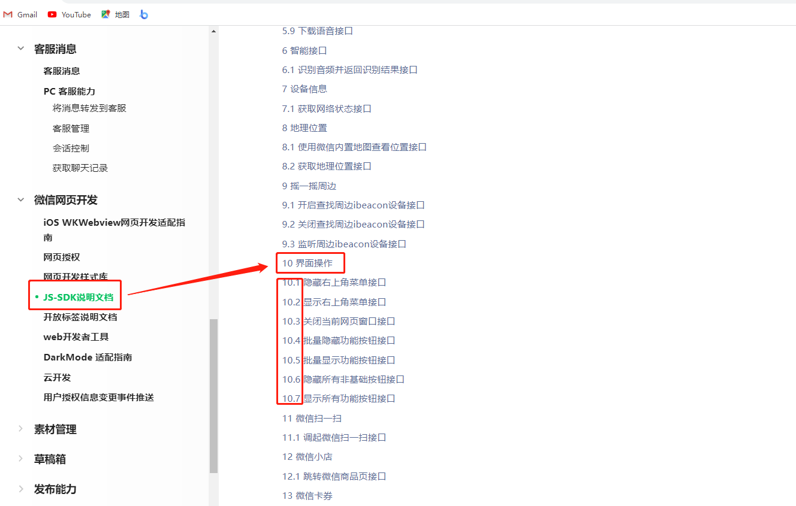
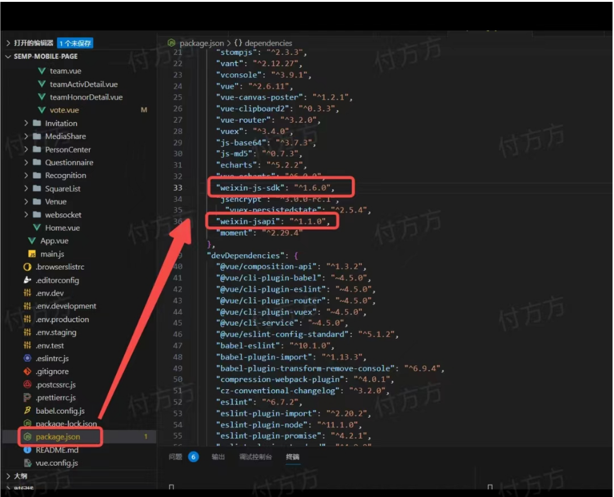
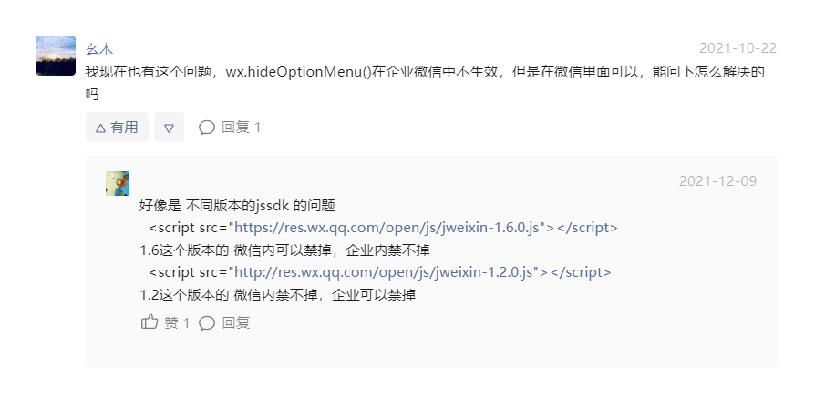
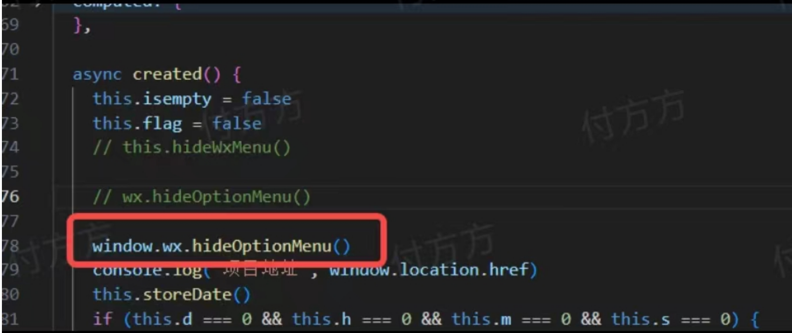
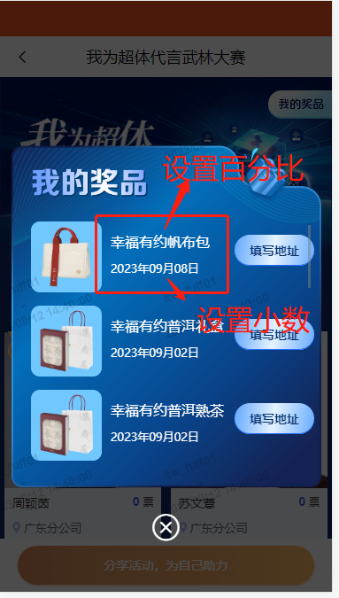
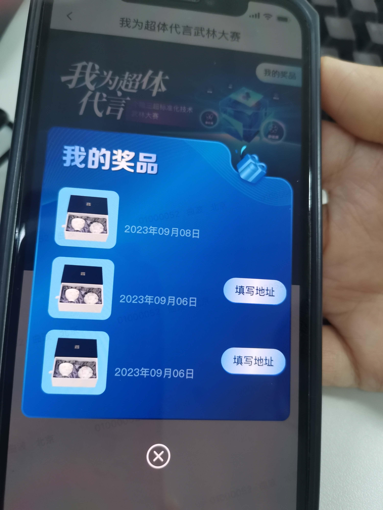
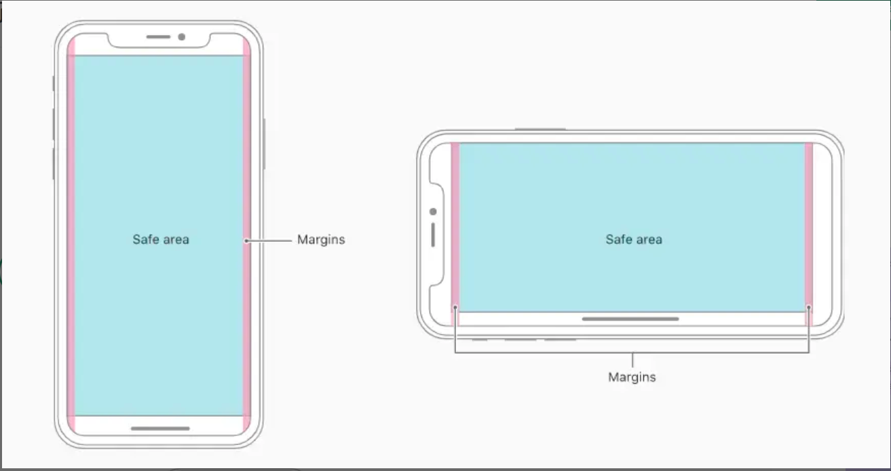

#### 微信隐藏顶部菜单方法：wx.hideOptionMenu()失效？

答：

__前情提要：__ 业务要求禁掉微信分享、转发等功能。在微信开发平台官网，文档切换到公众号，找到了隐藏菜单的方法，如下图（1）所示。下载所需要的包引入页面之后，1.1版本时而有效时而无效，引入方式如图（2）所示。






问题研究：

>研究一：

 微信开发社区说，有可能是版本问题，如图。我下载1.6版本，同1.1版本的引入方式相同，依然无效。




>研究二:

 以包的形式引入页面，方法放到this.$nextTick()中，依然无效。

>研究三：

 通过script方式引入1.6版本，页面直接用window.调用，有效。调用方式，如图所示：




>研究四：

 通过script方式引入1.2版本，页面直接window.调用，有效。因此可排除版本问题。

 __问题转向研究：__ 版本没用问题，是否与微信方法有关？

>研究五：

 同样使用页面引入包的形式，尝试引入1.1版本和1.6版本，将隐藏微信分享等功能，用一下代码实现：均无效。

```js
 // 隐藏微信分享等功能
 hideWxMenu() {
 function onBridgeReady() {
 window.WeixinJSBridge.call('hideOptionMenu')
 }

 if (typeof WeixinJSBridge === 'undefined') {
 if (document.addEventListener) {
 document.addEventListener('WeixinJSBridgeReady', onBridgeReady, false)
 } else if (document.attachEvent) {
 document.attachEvent('WeixinJSBridgeReady', onBridgeReady)
 document.attachEvent('onWeixinJSBridgeReady', onBridgeReady)
 }
 } else {
 onBridgeReady()
 }
 }
```

>研究六：

 用script方式，尝试引入微信sdk1.6版本和1.2版本，用研究五的代码实现微信隐藏菜单功能，均有效。因此可排除是引入微信方法的问题。

 __问题再次转向研究：__ 通过script方式引入，无论哪个版本都有效，以包的形式引入页面，无论哪个版本都无效，是否与引入方式有关？目前查了百度，也问了同事，结果是： 这两种引入的方式差别不大，按理来说，应该不会造成这么大的差别，研究的最后，并没有找到造成问题的原因，这个问题，目前依然没有解决。

<!-- 微信隐藏菜单问题，未完待续......... -->

#### 透明度opacity的不同写法对安卓机和苹果机的影响。

答： 

对如图所示中，上面一句设置：opacity:40%,下面一句设置：opacity:0.4



在不同机型的展示效果是:

>苹果机：设置百分比的那一行直接消失了，设置小数点的显示正常。



>安卓机：设置百分比的那一行没用效果，设置小数点的显示正常。


>注意：在本地调试的时候，设置百分比和小数点都是有效果的。但是在不同机型上会展示不同的效果。

__综上所述：__ opacity应该设置时使用小数点，以适用各种机型。


#### safe-area-inset-bottom属性。

答：

__定义：__ safe-area-inset-bottom是css里IOS11新增的属性，Webkit 的一个 CSS 函数，用于设定安全区域与边界的距离。



>作用(1)：IOS全面屏底部有小黑线，位于底部的元素会被黑线阻挡，可以使用以下样式：

代码设置前：


代码设置后：


代码：

```css

/* env() 与 constant() 设置安全区域 */
.model{
	padding-bottom: constant(safe-area-inset-bottom); /* 兼容 iOS < 11.2 */
 	padding-bottom: env(safe-area-inset-bottom); /* 兼容 iOS >= 11.2 */
}

```

>作用(2):获取高度时，可用:

```css
.model{
	height: calc(100% - constant(safe-area-inset-bottom));
	height: calc(100% - env(safe-area-inset-bottom));
}

```

>作用事项：

1. env()和constant()函数有个必要的使用前提，H5网页设置viewport-fit=cover的时候才生效，小程序里的viewport-fit默认是cover 可以直接使用 H5设置。

2. 先使用constant 再使用 env

>设置安全区域，有4个预定义变量：

- safe-area-inset-left: 安全区域距离左边界的距离

- safe-area-inset-right: 安全区域距离右边界的距离

- safe-area-inset-top: 安全区域距离顶部边界的距离

- safe-area-inset-bottom: 安全区域距离底部边界的距离


#### dayjs获取时间，可以兼容苹果机。遇到的问题：newDate（）获取时间没有，计算倒计时的时候，在苹果机显示NAN，苹果机和安卓机的时间格式不同，用dayjs可以解决格式问题。

13. 冒号是解释吗？

12. 计算属性在vue中的使用

#### 一些环境判断。

答：

```js
// 判断是否为iOS系统
export function isIOS() {
 return /ios|iphone|ipad|ipod/.test(navigator.userAgent.toLowerCase())
}

// 判断是否为微信环境
export function isMicroMessenger() {
 return /micromessenger/.test(navigator.userAgent.toLowerCase())
}

// 判断设备为IPAD

export function isInPad() {
 const ua = navigator.userAgent
 if (/tlifesalesPAD/i.test(ua)) {
 return true
 } else {
 return false
 }
}

// 判断是否为安卓系统
export function isAndroid() {
 return /android/.test(navigator.userAgent.toLowerCase())
}
```


3. 倒计时应该获取当前系统倒计时，还是后端系统倒计时，倒计时在项目中应该是谁做呢？


2. this.$nextTick()方法

 答： 


 8. 防抖和节流

 4. vuex的使用

 11. 父子组件传值